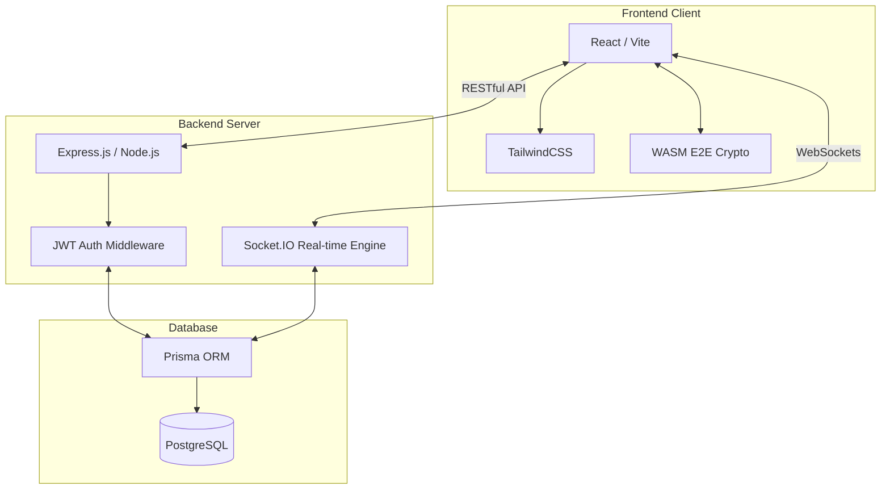
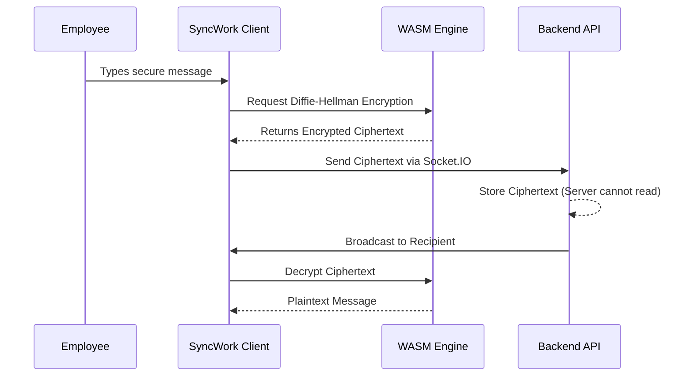

<div align="center">
  
# SyncWork
**Next-Generation Human Resource Management System (HRMS)**

[](https://reactjs.org/)
[](https://nodejs.org/)
[](https://www.prisma.io/)
[](https://www.postgresql.org/)
[](https://webassembly.org/)

Goodbye to fragmented spreadsheets and inefficient HR processes. **SyncWork** is an advanced, integrated, and highly secure HRMS designed to provide a smooth, seamless dashboard experience for both HR Officers and Employees.
</div>

---

## Core Features

* **Role-Based Access Control (RBAC):** Strict isolation between `EMPLOYEE`, `HR`, and `ADMIN` roles.
* **Departmental Isolation:** HR Officers are strictly siloed to manage only employees, leaves, and payroll within their specific department.
* **End-to-End Encrypted Chat:** Secure real-time communication powered by **WebAssembly (WASM)** and **Diffie-Hellman Key Exchange**.
* **Automated Leave Approvals:** Streamlined workflows for applying, reviewing, and approving/rejecting time-off requests.
* **Real-time Attendance Logs:** Instant clock-in/clock-out tracking synced directly to the PostgreSQL database.
* **Transparent Payroll Management:** Dynamic compensation adjustments with automatic base, allowance, and deduction calculations.

---

## System Architecture

SyncWork utilizes a modern, decoupled architecture ensuring high performance, real-time interactivity, and enterprise-grade security.



---

## Security & Data Flow

SyncWork takes security seriously. We implement strict Departmental Isolation and End-to-End Encryption for inter-employee communications.



---

## Technology Stack

### **Frontend**
- **React.js** (Context API for State Management)
- **Vite** (Next-generation frontend tooling)
- **TailwindCSS** (Utility-first styling & Dark Mode)
- **WebAssembly** (High-performance cryptographic operations)
- **Lucide React** (Beautiful SVG Icons)

### **Backend**
- **Node.js & Express.js** (Robust REST API)
- **Socket.IO** (Real-time bidrectional event-based communication)
- **Prisma ORM** (Type-safe database interaction)
- **PostgreSQL** (Relational Database)
- **JSON Web Tokens (JWT)** (Stateless Authentication)

---

## Getting Started

### Prerequisites
- Node.js (v18+ recommended)
- PostgreSQL (Running locally or via Docker)

### Installation
1. **Clone the repository:**
   ```bash
   git clone https://github.com/Kashcx-dev/_SyncWork_.git
   cd Hackathon-Oodo
   ```

2. **Setup Backend:**
   ```bash
   cd backend
   npm install
   npx prisma generate
   npx prisma db push
   npm run dev
   ```

3. **Setup Frontend:**
   ```bash
   cd frontend
   npm install
   npm run dev
   ```
**NOTE: DUMMY PROFILES ARE SHARED IN CONTEXT FOR BEST "MASS ACTIVITY" TESTING**
4. Open `http://localhost:5173` in your browser.

---
<div align="center">
<i>Engineered for the modern workforce. Built for scale.</i>
</div>
